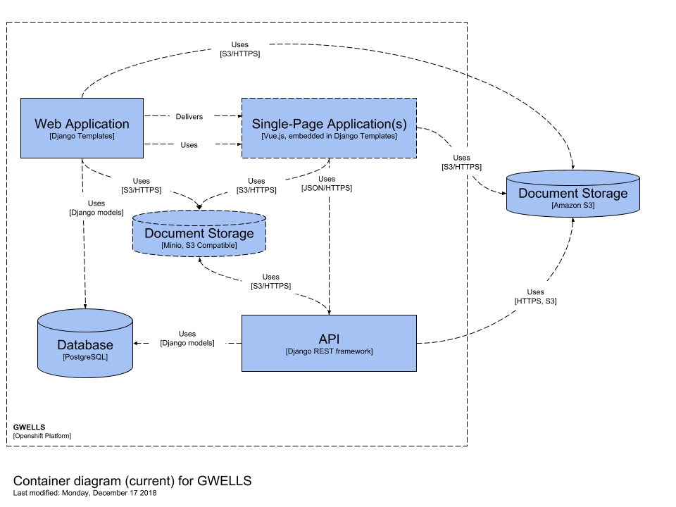

[](https://sonarqube-moe-gwells-tools.pathfinder.gov.bc.ca/dashboard?id=org.sonarqube%3Abcgov-gwells) [](https://sonarqube-moe-gwells-tools.pathfinder.gov.bc.ca/dashboard/index/org.sonarqube:bcgov-gwells)


# Groundwater Wells

## Introduction

The Ministry of Environment receives and processes groundwater data and information related to the construction, alteration and decommissioning of groundwater wells and stores that information in the WELLS system. Well construction and reporting requirements are regulated under the Water Sustainability Act and Groundwater Protection Regulation. The information collected and stored in WELLS is used by government and other users to help inform decisions related to the management of the groundwater resource in B.C.

GWELLS is the new groundwater data repository and is intended to replace the current WELLS system. GWELLS aims to improve the user experience when submitting  and searching for well information, to improve the quality of the data being submitted, and to improve the overall functionality of the system to meet user and regulatory requirements.

The application is being developed as an open source solution.

This is a [Django](http://www.djangoproject.com) project based on the [Openshift Django quickstart](https://github.com/openshift/django-ex) that is intended to be deployed on an [OpenShift](https://github.com/openshift/origin) cluster.

It uses the Openshift Source-to-Image (S2I) strategy with Python 3.5 on centos7.  See requirements.txt for Django and dependency versions.

## Development and Deployment

0.  ##### Prerequisites

    Install Docker and Git

    * [Docker Community Editions (signup  required)](https://store.docker.com/search?type=edition&offering=community)

    * [Git Downloads](https://git-scm.com/downloads)

    OS X alternative: Xcode with Git
    ```
    xcode-select --install
    ```

    Configure Git (user details, push default and line endings)
    ```
    git config --global user.email <GitHub registered email address>
    git config --global user.name <GitHub registered firstName LastName>
    git config --global push.default simple
    git config --global core.autocrlf input
    ```

1.  ##### GWells Repository

    Fork our repository into your own GitHub account.

    [GWells Repo (fork button in top right)](https://github.com/bcgov/gwells)

    Clone and cd.

    ```
    git clone https://github.com/<github-user>/gwells.git
    cd gwells
    ```

    Add remote (upstream) origin.

    ```
    git remote add upstream https://github.com/bcgov/gwells.git
    ```

2.  ##### GWells App

    Create a development deployment for working with Vue, Django or the API.
    ```
    cd gwells
    make [vue|django|api]
    ```

    Visit the following links depending on development target.

    * Django Frontend: http://localhost:8000/gwells/
    * Node/API: http://localhost:8080/

    <br>Changes will update dynamically in their respective environments.

## Contributing

Please see [CONTRIBUTING.md](https://github.com/bcgov/gwells/blob/master/CONTRIBUTING.md)

## Issues
Issues are tracked on the [GWELLS Trello board](https://trello.com/b/2UQZgXHR/wells-project-board).

## Architecture

### Current



### Vision

The current GWELLS architecture relies on Vue.js components being served up using Django templates. This 
approach results in a complicated interdependence between Vue.js and Django.

The intent is to completely seperate the front end into independently hosted Vue.js components and completely
drop Django templates.


## License

Code released under the [Apache License, Version 2.0](https://github.com/bcgov/gwells/blob/master/LICENSE).
